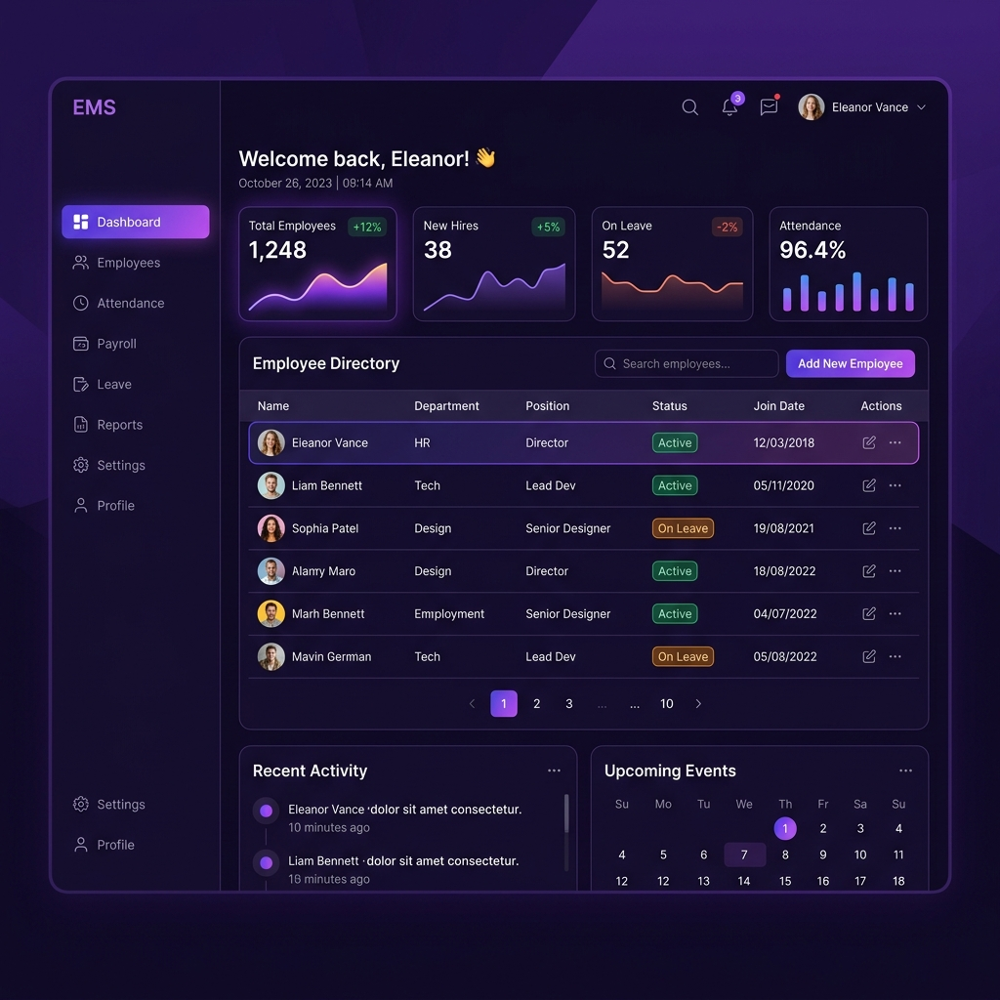
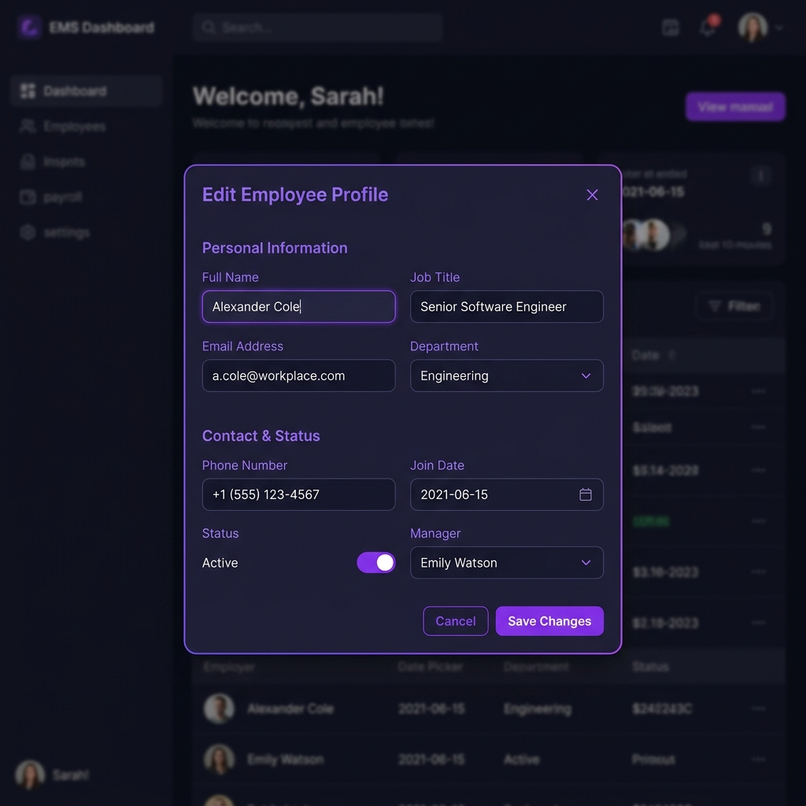

# Documentación del Sistema de Recursos Humanos y Control de Personal

Esta documentación proporciona una visión técnica e interactiva del sistema de Recursos Humanos, detallando su arquitectura, la renovación estética del frontend con degradados morados, endpoints de la API, y su guía de uso y despliegue.

---

## 1. Arquitectura y Stack Tecnológico

El sistema está construido sobre una arquitectura limpia y portátil de desarrollo rápido:

* **Backend**: **Django 6.0+** y **Django Rest Framework (DRF)**. Proporciona una API REST robusta y serializadores JSON para los datos de los empleados.
* **Base de Datos**: **SQLite 3**. Configurada para desarrollo sin dependencias externas complejas, almacenada localmente en el archivo `db.sqlite3`.
* **Frontend**: Una SPA (Single Page Application) responsiva embebida en la plantilla HTML de Django, construida con **HTML5 semántico** y **CSS3 nativo (CSS Variables)**. Utiliza fuentes tipográficas premium cargadas desde Google Fonts.
* **Integración**: La comunicación entre frontend y backend se realiza a través de llamadas asíncronas con `fetch` a la API local de Django.

---

## 2. Nueva Interfaz Visual (Tema Morado con Degradados)

La interfaz se ha actualizado con una estética moderna, responsiva y de alta fidelidad. Los estilos se controlan centralizadamente mediante variables CSS para facilitar su mantenimiento:

### Paleta de Colores y Tokens CSS (`:root`)
* **Fondo del Sistema (`--bg`)**: `#07040e` (Tono negro violáceo muy profundo y elegante).
* **Superficies (`--surface`, `--surface2`)**: `#110a21` y `#190f2f` (Contenedores en tonos morados oscuros para una apariencia premium).
* **Bordes Decorativos (`--border`, `--border-light`)**: `#3a206b` y `#552e9c`.
* **Acentos Principales (`--accent`, `--accent2`, `--accent3`)**: Tonos violetas y lavanda neón (`#8b5cf6`, `#5b21b6`, `#c084fc`).
* **Brillos y Sombras (`--shadow`, `--glow`)**: Sombras moradas translúcidas y resplandores suaves para elementos interactivos en hover.

### Componentes Clave
1. **Fondo con Gradientes Radiales**: El fondo de la página incorpora tres fuentes de luz radial difuminadas en tonos morado y lavanda que cambian sutilmente de posición.
2. **Tarjetas de Estadísticas**: Cuentan con un efecto *Glassmorphism* (cristal oscuro translúcido), un borde superior con degradado neón, y un efecto de elevación y resplandor al pasar el cursor (hover).
3. **Botones de Acción**: El botón "Nuevo Empleado" utiliza un degradado lineal morado de alto contraste con transiciones suaves de escala en hover.
4. **Tabla de Datos**: Filas interactivas con cambio de fondo suave al pasar el ratón, avatares con iniciales generados en degradado de color y etiquetas de departamentos personalizadas.

---

## 3. Mockups de la Interfaz de Usuario

A continuación se muestran capturas conceptuales que representan la estética y distribución del panel:

### Panel Principal (Dashboard)

### Formulario de Registro (Modal Popup)

---

## 4. Endpoints de la API REST

La API se expone en la ruta base `/api/empleados/` y admite las siguientes operaciones REST estándar:

| Método | Endpoint | Descripción | Cuerpo del Request (JSON) |
|---|---|---|---|
| **GET** | `/api/empleados/` | Obtiene la lista completa de empleados registrados. | Ninguno |
| **POST** | `/api/empleados/` | Registra un nuevo empleado en el sistema. | `{ "nombre": "...", "departamento": "...", "sueldo": 0.0 }` |
| **GET** | `/api/empleados/<idEmpleado>/` | Obtiene la información detallada de un empleado específico. | Ninguno |
| **PUT** | `/api/empleados/<idEmpleado>/` | Actualiza de forma completa los datos de un empleado. | `{ "nombre": "...", "departamento": "...", "sueldo": 0.0 }` |
| **DELETE** | `/api/empleados/<idEmpleado>/` | Elimina permanentemente a un empleado del sistema. | Ninguno |

---

## 5. Instrucciones de Despliegue y Ejecución Local

El proyecto cuenta con scripts de arranque automático y autorreparación (Self-Healing) que configuran el entorno local sin necesidad de comandos manuales:

1. **Requisitos Previos**:
   * Asegúrate de tener Python 3.10 o superior instalado en el sistema.
2. **Ejecución en Windows**:
   * Simplemente ejecuta en PowerShell el archivo `iniciar.ps1` o haz doble clic en el archivo por lotes `iniciar.bat`.
   * El script verificará la instalación de Python, recreará automáticamente el entorno virtual (`venv`) si este pertenece a otro usuario o está corrupto, instalará Django y sus dependencias con `pip` y finalmente correrá las migraciones e iniciará el servidor de desarrollo.
3. **Acceso al Panel**:
   * Abre tu navegador en la dirección: **`http://localhost:8000/`**
